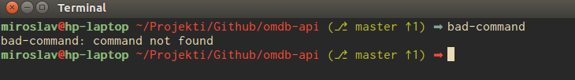

# Info

Informative prompt in pure Bash script. 

## Features

* Prompt style: display "➡" symbol instead of "$"
* Git branch: display "⎇ " symbol and current git branch name, or short SHA1 hash when the head is detached
* Git branch: display "+" symbol when current branch is changed but uncommited
* Git branch: display "↑" symbol and the difference in the number of commits when the current branch is ahead of remote (see screenshot)
* Git branch: display "↓" symbol and the difference in the number of commits when the current branch is behind of remote (see screenshot)
* Display "L" for local repositories
* Color code for the previously failed command
* Display different color for the root user 
* Fast execution (no noticeable delay)

## Installation

Download the Bash script

And source it in your `.bashrc`

    source ~/.bash-powerline.sh

## See also

* [bash-git-prompt](https://github.com/magicmonty/bash-git-prompt): An informative and fancy bash prompt for Git users 
* [oh-my-zsh](https://github.com/robbyrussell/oh-my-zsh): zsh framework with lots of themes and plugins
